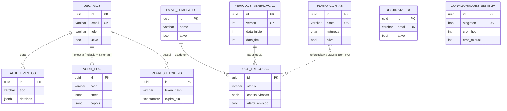

# Modelo de Dados

**Última atualização:** 02/07/2026
**Versão do documento:** v1
**Estado do projeto refletido:** desenvolvimento ativo; tabela `configuracoes_sistema` ainda planejada
**Público:** desenvolvedores (backend)

## Objetivo do documento

Descrever as entidades do banco de dados do SACC (Sistema de Alertas Contábeis), seus relacionamentos e as convenções de modelagem.

## Contexto de negócio

Cada tabela existe para sustentar uma parte do ciclo de detecção e alerta: o `plano_contas` guarda a [natureza](../negocio/glossario.md#natureza-dc) esperada de cada conta — o gabarito contra o qual os saldos do ERP (Enterprise Resource Planning) são comparados na [detecção de virada](../negocio/regras-de-negocio.md); `destinatarios` e `email_templates` definem quem é avisado e como; `periodos_verificacao` e `logs_execucao` controlam e historiam as execuções; as demais sustentam autenticação e auditoria, exigências de um sistema que altera configurações de alerta contábil.

## Entidades

O banco da aplicação tem **10 tabelas de domínio** (mais a tabela de controle de migrations do Alembic). A décima, `configuracoes_sistema`, está **planejada** e ainda não aplicada.

> **Nota de divergência na fonte:** o Knowledge Source ora fala em "10 tabelas" já existentes, ora em 10 tabelas de domínio sendo uma planejada. Esta documentação adota a segunda descrição, mais detalhada.

### 1. `usuarios`
Autenticação local (e-mail + senha) — ver [ADR-001](./decisoes/adr-001-auth-local.md).

| Coluna | Tipo | Nota |
|---|---|---|
| id | UUID PK | |
| email | VARCHAR UK | Login |
| nome_completo | VARCHAR | Exibido na UI e na auditoria |
| password_hash | VARCHAR | Argon2id |
| role | VARCHAR | `'admin'` ou `'usuario'` |
| ativo | BOOL | [Soft-delete](../negocio/glossario.md#soft-delete) |
| must_change_password | BOOL | Força troca no próximo login |
| falhas_login | INT | Contador para lockout |
| bloqueado_ate | TIMESTAMPTZ | Fim do lockout temporário |
| ultimo_login_em | TIMESTAMPTZ | |
| criado_em, criado_por, atualizado_em | | |

### 2. `auth_eventos`
Auditoria de segurança (login com sucesso/falha, lockout, troca de senha). Mantida **separada** de `audit_log` intencionalmente — ver [ADR-003](./decisoes/adr-003-auditoria.md).

Colunas principais: `id`, `usuario_id` (FK), `tipo` (ex.: `login_sucesso`, `login_falha`, `lockout`), `email_tentado`, `ip_origem`, `user_agent`, `detalhes` (JSONB), `criado_em`.

### 3. `audit_log`
Auditoria de ações de domínio (CRUDs e execuções).

Colunas principais: `id`, `acao` (`criou`/`atualizou`/`excluiu`/`executou`), `entidade_tipo`, `entidade_id`, `entidade_descricao`, `usuario_id` (FK, nullable — NULL significa "Sistema", isto é, o agendador), `usuario_nome` (redundante, preserva histórico), `antes`/`depois` (JSONB com o diff), `criado_em`.

A interceptação é **manual** em cada repository (sem listeners do ORM), sempre na mesma transação da operação auditada — ver [ADR-003](./decisoes/adr-003-auditoria.md).

### 4. `plano_contas`
Contas contábeis monitoradas.

| Coluna | Tipo | Nota |
|---|---|---|
| id | UUID PK | |
| conta | VARCHAR UK | Código contábil (ex. ilustrativo: `"1.1.01.001"`) |
| descricao | VARCHAR | ex. ilustrativo: `"Banco Conta Movimento"` |
| natureza | CHAR(1) | `'D'` (Devedora) ou `'C'` (Credora) |
| ativo | BOOL | Soft-delete |
| criado_em, atualizado_em, atualizado_por | | |

**Evolução planejada** (feature de sincronização com o ERP): `classe` (`'analitica'`/`'sintetica'`), `codigo_grupo`, `codigo_conta_pai` e `sincronizado_em` — campos derivados do plano de contas do ERP.

**Sem campo `origem`** — decisão fechada: a fonte única de verdade é o ERP; não há cadastro manual ([ADR-005](./decisoes/adr-005-plano-contas-fonte-unica.md)).

### 5. `destinatarios`
Endereços de e-mail que recebem os alertas. Colunas: `id`, `nome`, `email` (UK), `ativo`, timestamps.

### 6. `email_templates`
Biblioteca de templates de alerta. Colunas: `id`, `nome`, `assunto`, `corpo_html`, `ativo`, `versao` (legado, mantido para logs antigos), timestamps e autores.

Múltiplos templates podem estar ativos ao mesmo tempo; o worker usa o **mais recentemente atualizado** entre os ativos ([ADR-010](./decisoes/adr-010-templates-biblioteca.md)).

### 7. `periodos_verificacao`
Configuração **append-only** de qual período verificar no ERP.

| Coluna | Nota |
|---|---|
| id UUID PK | |
| versao INT UK | Incrementada a cada nova versão |
| data_inicio, data_fim INT | Formato YYYYMMDD |
| empresa_codigo INT | Ainda singular — suporte multi-empresa em discussão |
| criado_em, criado_por | |

Para "alterar" a configuração, cria-se nova versão; o worker usa a mais alta.

### 8. `logs_execucao`
Histórico de execuções do worker (ver [Fluxo de Execução](../operacao/fluxo-de-execucao.md)).

Colunas principais: `id`, `iniciado_em`, `finalizado_em`, `status` (`executando`/`sucesso`/`sem_alertas`/`erro`), `tipo_execucao` (`agendada`/`manual`), referências de período e empresa, `qtd_contas_analisadas`, `qtd_contas_viradas`, `contas_viradas` (snapshot JSONB), campos de erro (`erro_mensagem`, `erro_tipo`, `stack_trace`), `duracao_ms`, `alerta_enviado`.

### 9. `refresh_tokens`
Substitui o Redis ([ADR-002](./decisoes/adr-002-remocao-redis.md)). Tokens de refresh JWT (JSON Web Token) com rotação.

Colunas: `id`, `token_hash` (nunca o token em claro), `usuario_id` (FK), `expira_em`, `revogado_em`, `criado_em`, `ip_origem`.

### 10. `configuracoes_sistema` *(planejada)*
[Singleton](../negocio/glossario.md#singleton-contexto-de-banco-de-dados) com a configuração do worker e das notificações ([ADR-006](./decisoes/adr-006-configuracoes-singleton.md)).

Colunas: `id`, `singleton` (BOOL com constraint UNIQUE garantindo linha única), `cron_hour`, `cron_minute`, `execucao_automatica_ativa`, `alertas_execucao_ativos`, `atualizado_em`, `atualizado_por`.

## MER

O plano de contas local é populado por sincronização (upsert) a partir da view de plano de contas do ERP — ver [Integrações](./integracoes.md). A feature planejada de sincronização inclui também uma tabela de histórico de sincronizações, relacionada a `usuarios` quando o disparo é manual.

## Convenções de modelagem

- **PK sempre UUID** (`gen_random_uuid()`).
- **Timestamps sempre `TIMESTAMPTZ`** em UTC; renderização no fuso de Brasília na interface e nos e-mails ([ADR-014](./decisoes/adr-014-timezone-utc.md)).
- **Soft-delete via `ativo BOOL`** — nunca DELETE físico em entidades de domínio.
- **JSONB para snapshots históricos** (`contas_viradas`, `antes`, `depois`).
- **`atualizado_por` grava o `nome_completo`** do usuário, não o e-mail.
- **Constraint UNIQUE em `singleton BOOL`** para tabelas de linha única.

## Links relacionados

- [Regras de Negócio](../negocio/regras-de-negocio.md) — como `plano_contas` participa da detecção.
- [Integrações](./integracoes.md) — sincronização com o ERP.
- [Decisões Arquiteturais](./decisoes/index.md) — ADRs citados neste documento.

<!--
Checklist de revisão:
Segurança: exemplos de conta/descrição reais substituídos por genéricos; nomes de colunas do ERP omitidos ("campos derivados do plano de contas do ERP"); números de migration internos omitidos; sem IPs/credenciais/nomes reais; tabela órfã em banco default omitida (detalhe interno de ambiente). OK.
Fonte da verdade: entidades e convenções de 03-modelo-dados.md; divergência de contagem de tabelas sinalizada; configuracoes_sistema marcada como planejada. OK.
Editorial: siglas expandidas; termos linkados ao glossário; decisões linkam ADRs; data presente; voz impessoal. OK.
Negócio: abre explicando por que cada grupo de tabelas existe em função da detecção/alerta. OK.
-->
