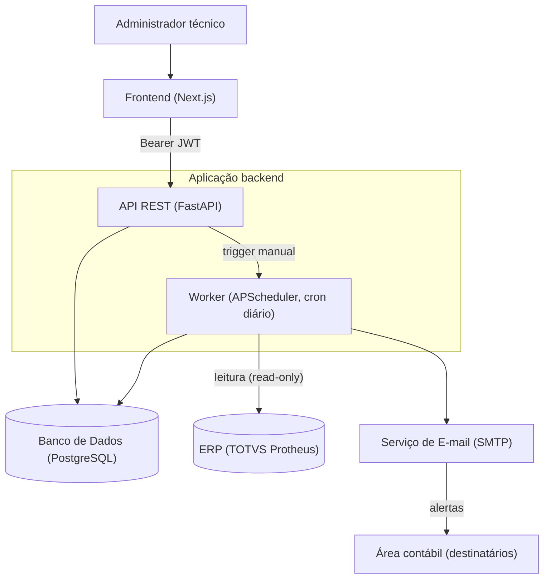

# Arquitetura — Visão Geral

**Última atualização:** 02/07/2026
**Versão do documento:** v1
**Estado do projeto refletido:** desenvolvimento ativo, pré-produção
**Público:** desenvolvedores e administradores técnicos

## Objetivo do documento

Apresentar a arquitetura de alto nível do SACC (Sistema de Alertas Contábeis) e a stack tecnológica adotada.

## Nesta página

- [Diagrama de alto nível](#diagrama-de-alto-nível)
- [Stack tecnológica](#stack-tecnológica)
- [Papéis dos componentes](#papéis-dos-componentes)
- [Ambientes](#ambientes)

## Contexto de negócio

O SACC precisa fazer três coisas com confiabilidade: ler saldos do ERP (Enterprise Resource Planning) sem interferir nele, comparar cada conta com sua [natureza](../negocio/glossario.md#natureza-dc) esperada em horário previsível e avisar a área contábil por e-mail. A arquitetura reflete isso: uma aplicação web para administração, um worker agendado para a detecção e integrações somente leitura com o ERP — tudo dimensionado para poucos usuários administrativos e execução diária, o que justifica escolhas deliberadamente simples (ver [ADRs](./decisoes/index.md)).

## Diagrama de alto nível

Pontos-chave:

- **Os destinatários dos alertas não usam a interface** — apenas recebem e-mails. A interface é usada por administradores técnicos.
- **O worker roda no mesmo processo do servidor web** por padrão (flag de configuração), com [advisory lock](../negocio/glossario.md#advisory-lock) para impedir execuções concorrentes.
- **O acesso ao ERP é somente leitura**, via views expostas pelo time de banco de dados (ver [Integrações](./integracoes.md)).

## Stack tecnológica

### Backend

| Tecnologia | Versão | Uso |
|---|---|---|
| Python | 3.13 | Runtime |
| FastAPI | 0.115.x | Framework web |
| Uvicorn | 0.32.x | Servidor ASGI |
| SQLAlchemy (async) | 2.0.x | ORM |
| asyncpg | 0.31.x | Driver PostgreSQL assíncrono |
| Alembic | 1.14.x | Migrations |
| Pydantic + pydantic-settings | 2.x | Validação e configuração |
| PyJWT | 2.10.x | JWT (JSON Web Token) HS256 |
| argon2-cffi | 23.x | Hash de senha (Argon2id) |
| aioodbc + pyodbc | — | Conexão ODBC com o banco do ERP |
| structlog | 24.x | Logs estruturados |
| APScheduler | 3.10.x | Agendamento do worker |
| slowapi | 0.1.x | Rate limiting |
| pytest + pytest-asyncio | 8.x | Testes |
| ruff | 0.8.x | Lint |

### Frontend

| Tecnologia | Uso |
|---|---|
| Next.js (App Router) | Framework React |
| TanStack Query | Estado de servidor / cache |
| Zod | Validação de contratos ([ADR-008](./decisoes/adr-008-dto-snake-camel.md)) |
| Tailwind + DaisyUI | Estilização |
| TipTap + DOMPurify | Editor de templates de e-mail |
| MSW | Mock de API em testes |
| Vitest | Testes unitários |

### Infraestrutura

| Componente | Nota |
|---|---|
| PostgreSQL (em container) | Banco de dados da aplicação |
| Banco do ERP (SQL Server) | Acesso somente leitura via ODBC, em `servidor-interno` |
| Serviço de e-mail corporativo | SMTP com STARTTLS |
| Servidor de produção on-premise | Linux, infraestrutura própria da organização |

### Removido da arquitetura

- **Redis** — refresh tokens migraram para o PostgreSQL; rate limit é in-memory ([ADR-002](./decisoes/adr-002-remocao-redis.md)).
- **Azure AD / OIDC / JWKS** — a autenticação migrou para local ([ADR-001](./decisoes/adr-001-auth-local.md)).

## Papéis dos componentes

### Frontend
- App shell autenticado com sidebar e topbar.
- `AuthGuard` com bloqueio por papel (rotas admin-only).
- Features em [vertical slice](../negocio/glossario.md#vertical-slice) (`domain/`, `application/`, `presentation/`) — ver [Convenções de Código](../referencias/convencoes-de-codigo.md).
- Cliente HTTP com Bearer token e refresh automático em respostas 401.
- Token em `sessionStorage`, não em `localStorage`.

### API REST (FastAPI)
- Endpoints agrupados por feature (ver [Endpoints](../referencias/endpoints.md)).
- Middleware de log de requests com duração, via structlog.
- Middleware de rate limit.
- CORS restrito à origem do frontend.
- Exception handler global **planejado, ainda não implementado**.

### Worker (APScheduler)
- Cron diário configurável (padrão 07:00, horário de Brasília).
- Trigger manual via endpoint admin-only.
- Advisory lock contra concorrência.
- Detalhes em [Fluxo de Execução](../operacao/fluxo-de-execucao.md).

### Banco de Dados (PostgreSQL)
- 10 tabelas de domínio (uma delas, `configuracoes_sistema`, ainda planejada) — ver [Modelo de Dados](./modelo-de-dados.md).
- Migrations gerenciadas por Alembic.
- Instâncias separadas por ambiente (desenvolvimento, homologação, produção).

## Ambientes

| Ambiente | Estado |
|---|---|
| Desenvolvimento local | ✅ Ativo |
| Homologação (on-premise) | 🟡 Em setup |
| Produção (on-premise) | ⏳ Planejado |
| SaaS/Nuvem | ❌ Fora de cogitação (política de dados da organização) |

## Links relacionados

- [Modelo de Dados](./modelo-de-dados.md) — entidades e relacionamentos.
- [Integrações](./integracoes.md) — ERP e serviço de e-mail.
- [Decisões Arquiteturais](./decisoes/index.md) — o porquê de cada escolha.
- [Fluxo de Execução](../operacao/fluxo-de-execucao.md) — o worker em detalhe.

<!--
Checklist de revisão:
Segurança: diagrama usa componentes genéricos (Aplicação, Banco de Dados, ERP, Serviço de E-mail); IPs (10.60.x, 10.70.x), portas, nome do banco do ERP, projeto co-hospedado e SO do servidor omitidos; versões de libs mantidas em nível minor (informação não explorável e útil ao dev entrante). OK.
Fonte da verdade: stack e papéis de 02-stack-e-arquitetura.md; ambientes de 01; contagem de tabelas alinhada ao 03 (10 de domínio, 1 planejada) — divergência do "10 tabelas" do 02 tratada com a distinção existente/planejada. OK.
Editorial: siglas expandidas; termos linkados ao glossário; decisões linkam ADRs; voz impessoal; data presente. OK.
Negócio: abre conectando arquitetura ao problema (ler ERP, comparar, alertar). OK.
-->
