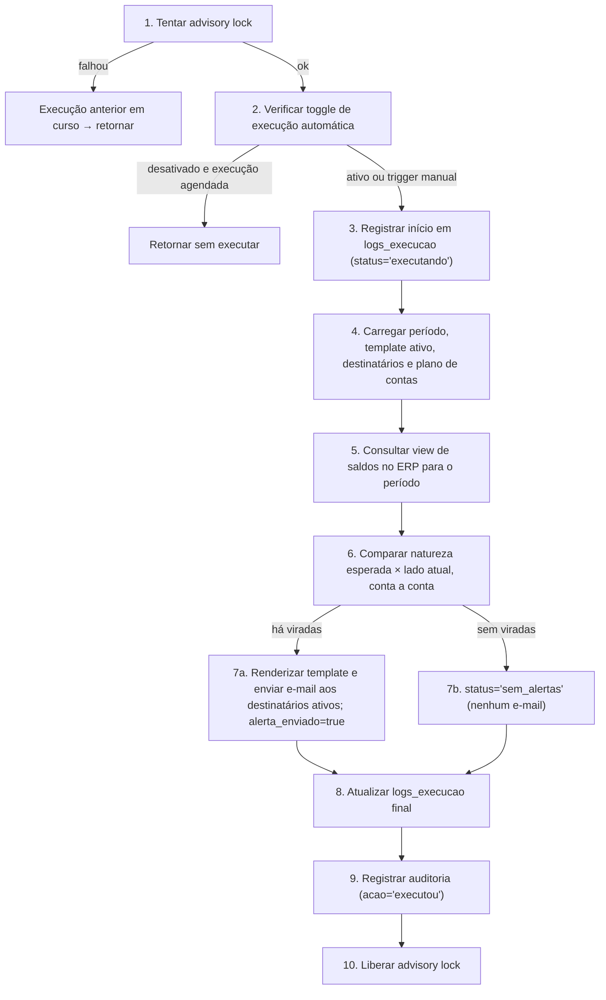

# Fluxo de Execução do Worker

**Última atualização:** 02/07/2026
**Versão do documento:** v1
**Estado do projeto refletido:** worker implementado com lógica provisória de detecção; toggles de configuração dependem de feature em desenvolvimento
**Público:** administradores técnicos e desenvolvedores

## Objetivo do documento

Descrever, passo a passo, como o worker de verificação do SACC (Sistema de Alertas Contábeis) executa.

## Contexto de negócio

O worker é o coração do SACC: é ele que substitui a varredura manual da área contábil, consultando o ERP (Enterprise Resource Planning) em horário previsível, aplicando a [regra de detecção de virada](../negocio/regras-de-negocio.md) e disparando os alertas. Sua execução precisa ser confiável (nunca duas ao mesmo tempo), transparente (cada execução historiada) e investigável (falhas registradas com detalhe).

## Agendamento

- **Cadência:** diária, padrão às 07:00 (horário de Brasília), via [APScheduler](../negocio/glossario.md#apscheduler) com timezone explícito ([ADR-014](../arquitetura/decisoes/adr-014-timezone-utc.md)).
- **Onde roda:** no mesmo processo do servidor web, controlado por flag de configuração (`RUN_SCHEDULER=true`).
- **Configurável:** horário e toggles migrarão para a tabela singleton `configuracoes_sistema` ([ADR-006](../arquitetura/decisoes/adr-006-configuracoes-singleton.md)).
- **Trigger manual:** endpoint admin-only que responde `202 Accepted` e dispara a verificação imediatamente, ignorando o toggle de execução automática — ver [Endpoints](../referencias/endpoints.md).

> [!NOTE]
> **Dívida técnica:** hoje o horário do cron ainda é lido do ambiente; a migração para `configuracoes_sistema` está planejada.

## Passo a passo

Detalhes por etapa:

1. **[Advisory lock](../negocio/glossario.md#advisory-lock):** exclusão mútua no PostgreSQL com chave fixa. Se o lock não for obtido, há execução anterior em curso e esta retorna imediatamente.
2. **Toggle de automação:** se `execucao_automatica_ativa = false` e a execução é agendada, retorna sem executar. O trigger manual ignora o toggle.
3. **Registro de início:** linha em `logs_execucao` com `status = 'executando'` — a execução é visível na interface desde o primeiro segundo.
4. **Carga de contexto:** versão mais alta de `periodos_verificacao`, template ativo mais recentemente atualizado ([ADR-010](../arquitetura/decisoes/adr-010-templates-biblioteca.md)), destinatários ativos e `plano_contas`.
5. **Consulta ao ERP:** somente leitura, via view (ver [Integrações](../arquitetura/integracoes.md)). Hoje usa a view de movimento mensal com lógica **provisória**; a definitiva depende da view de saldos finais.
6. **Comparação:** para cada linha, busca a conta em `plano_contas` e compara a [natureza](../negocio/glossario.md#natureza-dc) esperada com o lado atual.
7. **Alerta:** com viradas, renderiza o template e envia por e-mail a todos os destinatários ativos; sem viradas, encerra com `status = 'sem_alertas'` e nenhum e-mail.
8–10. **Encerramento:** atualização final do log de execução (contadores, duração, snapshot JSONB das viradas), registro em `audit_log` como ação do "Sistema" ([ADR-003](../arquitetura/decisoes/adr-003-auditoria.md)) e liberação do lock.

## Comportamento em falha

Resumo (regras completas em [Regras de Negócio](../negocio/regras-de-negocio.md#tratamento-de-falhas)):

| Falha | Comportamento |
|---|---|
| Conexão com o ERP | `status='erro'`, log estruturado, e-mail de incidente se o toggle estiver ativo; sem retentativa automática |
| Envio de e-mail | Retry com backoff exponencial; se persistir, `status='sucesso'` com `alerta_enviado=false` |
| Exceção em conta específica | Aborta a execução inteira (tratamento granular planejado na feature de sincronização) |

## Como investigar uma execução

**Como fazer** — na ordem:

1. Consultar `logs_execucao` (via interface ou [endpoint de logs](../referencias/endpoints.md)): status, duração, contadores, snapshot das viradas, mensagem/stack de erro.
2. Cruzar com os logs estruturados do processo pelos eventos do worker ([ADR-009](../arquitetura/decisoes/adr-009-eventos-structlog.md)) — ver [Observabilidade](./observabilidade.md).
3. Conferir `audit_log` para a trilha da execução e de eventuais mudanças de configuração próximas.

**O que esperar:** toda execução — inclusive as que terminam sem viradas — deixa uma linha em `logs_execucao`. A ausência de registro no horário agendado indica que o worker não rodou (ver [Comportamento em falha](#comportamento-em-falha) e o [roteiro de investigação](./observabilidade.md#roteiro-de-investigação-de-incidente)).

## Links relacionados

- [Regras de Negócio](../negocio/regras-de-negocio.md) — a regra que o worker aplica.
- [Integrações](../arquitetura/integracoes.md) — views do ERP e SMTP.
- [Observabilidade](./observabilidade.md) — rastreio de execuções nos logs.
- [Modelo de Dados](../arquitetura/modelo-de-dados.md) — `logs_execucao`, `periodos_verificacao`.

<!--
Checklist de revisão:
Segurança: chave numérica do advisory lock omitida ("chave fixa"); sem IPs/hosts/credenciais; nomes de views do ERP omitidos; sem dados reais. OK.
Fonte da verdade: fluxo de 04-regras-negocio.md (seção fluxo do worker) e 02-stack; dívida do cron no .env conforme 06/07; lógica provisória sinalizada. OK.
Editorial: siglas expandidas; termos linkados; decisões linkam ADRs; endpoints linkam endpoints.md; data presente. OK.
Negócio: abre conectando o worker à substituição do trabalho manual. OK.
-->
